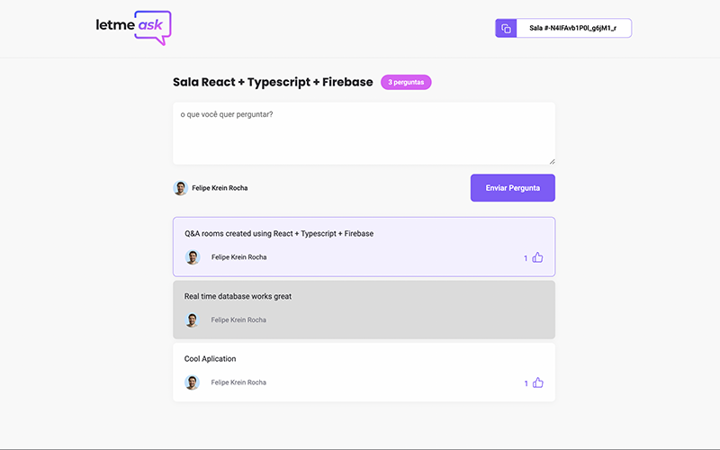

# Letmeask
Create an Q&A room and let your audience ask questions and upvote the best ones.
<br>
<br>
<a href="https://letmeask-8f3d9.web.app/">Letmeask Firebase Deployment</a>
</br>
</br>

### Technologies
* Typescript
* React
* Sass
* Firebase
### Firebase setup
Create a new Firebase project with Google Authentication and Realtime Database.
<br>
Use the project keys to create a .env.local file in the root of your project.
#### Root file: .env.local
```
REACT_APP_API_KEY="your_api_key"
REACT_APP_AUTH_DOMAIN="your_auth_domain"
REACT_APP_DATABASE_URL="your_database_url"
REACT_APP_PROJECT_ID="your_project_id"
REACT_APP_STORAGE_BUCKET="your_storage_bucket"
REACT_APP_MESSAGING_SENDER_ID="your_sender_id"
REACT_APP_APP_ID="your_app_key"
```